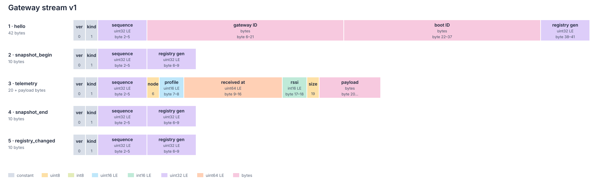

# Gateway telemetry WebSocket

`ws://<gateway>/ws` exposes accepted node telemetry as binary server-to-client messages. The gateway decodes the common radio telemetry prefix but not profile-specific measurements. All multi-byte integers are little-endian.

[`protocol-manifest.json`](../protocol/protocol-manifest.json) is the canonical machine-readable source for the message kinds and byte layouts below. This document defines lifecycle and recovery behaviour that is not represented by the manifest.

This document freezes stream version `1`. A breaking byte-layout or lifecycle change requires a new `stream_version`; adding a message kind does not, because consumers must ignore kinds they do not recognize.

## Message layouts

Every message starts with a six-byte common prefix containing stream version `1`, message kind, and the gateway telemetry sequence watermark. The generated diagram is the byte-layout reference for the common prefix and all message kinds.



The telemetry sequence is an unsigned wrapping 32-bit counter. It starts a new sequence space after every boot; `boot_id` identifies that space. Consumers compare values within one boot using wrapping unsigned ordering and replace a node's cached value only with a newer sequence. Duplicate sequence values for the same node are harmless.

## HELLO

`HELLO` is exactly 42 bytes and is always the first message on a connection. Its sequence is the current telemetry watermark.

The two IDs are raw bytes in the same order as the byte pairs in their 32-character lowercase hexadecimal representations from `GET /api/info`. The consumer requires both IDs to match the REST bootstrap. A mismatch means the connection is not the gateway just authenticated and must not be used.

The consumer also compares the HELLO registry generation with the `/api/nodes` response. If they differ, it refetches `/api/nodes` and does not attribute telemetry by node ID until it has the matching registry generation.

## SNAPSHOT_BEGIN and SNAPSHOT_END

Both snapshot controls are exactly ten bytes and carry the durable registry generation observed at their respective boundary.

The begin sequence is the telemetry watermark before cache enumeration. The end sequence is the watermark after enumeration; they may differ when telemetry arrives while the snapshot is being produced. Every cached telemetry message sent inside the snapshot has a sequence no newer than the end watermark.

The two registry generations must match. If they do not, the registry changed while the snapshot was being produced: the consumer discards that snapshot, refetches `/api/nodes`, and reconnects for a fresh snapshot. Generation is also wrapping; consumers need only equality, not ordering.

## TELEMETRY

The common-prefix sequence belongs to this telemetry record. The timestamp is UTC Unix milliseconds, or `0` before NTP sync; RSSI is signed dBm. The payload contains the complete v2 radio frame, including its protocol header.

The exact message size is `20 + radio_payload_size`. The profile ID must match the current registry record for the node ID. The complete radio frame is decoded according to [PROTOCOL.md](../protocol/PROTOCOL.md).

A zero timestamp means the packet arrived before the gateway synchronized its clock. A consumer uses its own receipt time in that case.

## REGISTRY_CHANGED

`REGISTRY_CHANGED` is exactly ten bytes and carries the new durable registry generation. Its common-prefix sequence is the current telemetry watermark.

It is sent when the durable node registry changes while a client is connected: a rename, deletion, completed pairing, state change, or other committed registry mutation. The consumer stops attributing new telemetry whose node mapping may be stale, refetches `GET /api/nodes`, and resumes once the returned generation matches the notification.

Radio node IDs are reused. This message is therefore the primary correctness mechanism, not merely an optimization over polling. A radio network reset also clears the registry but restarts the gateway, so reconnect bootstrap covers that case even if the notification is not delivered first.

The gateway observes registry generation once per main-loop pass, outside the registry lock. If a bounded WebSocket transmit queue fills, that client is disconnected and recovers through a new bootstrap rather than remaining silently stale.

## Session lifecycle

The server sends messages in this order:

```text
HELLO
SNAPSHOT_BEGIN
zero or one cached TELEMETRY per node
SNAPSHOT_END
live TELEMETRY and REGISTRY_CHANGED messages
```

After every reconnect the consumer refetches `/api/info` and `/api/nodes`, validates `HELLO`, and rebuilds its in-memory telemetry state from the complete snapshot. It must not carry a previous boot's sequence comparisons into the new `boot_id`.

An active registry node absent from a completed snapshot has no telemetry since this gateway boot. Its Home Assistant entities are `unknown`, not unavailable. Disconnection makes gateway-backed entities unavailable.

The socket sends a keep-alive ping every 30 seconds and retains at most four clients. Malformed messages, a wrong stream version, an invalid first message, identity mismatch, or an inconsistent snapshot require reconnect rather than best-effort parsing.

The handshake requires either an authenticated browser session cookie or an API bearer token with the `telemetry:read` scope. Unauthorized clients receive HTTP `401` before protocol upgrade.

A client should send an `X-Client` handshake header naming itself, such as `home-assistant/0.3.0`. The value is optional, printable ASCII, and limited by the gateway to 32 characters. It remains an HTTP header so the gateway knows the client identity from the moment the socket is accepted; there is no client-to-server binary message protocol.
